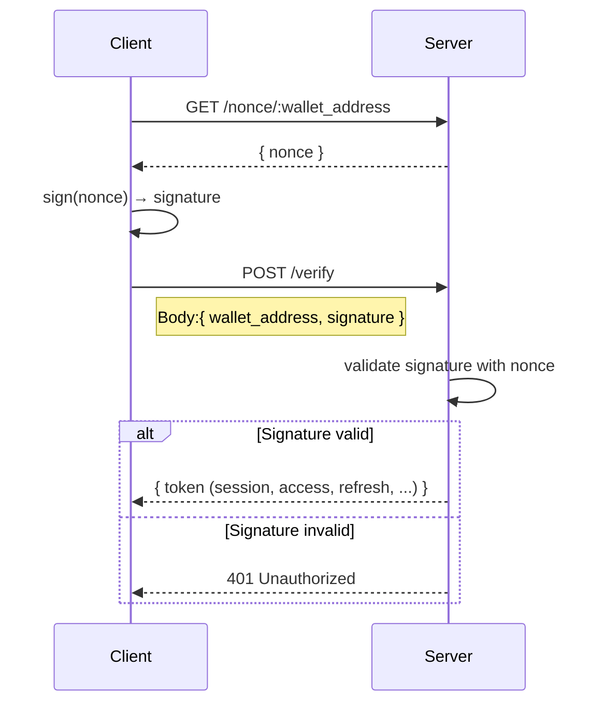

# zxauth

**zxauth** is a minimal authentication SDK that enables **Sign-in with Ethereum** using just a wallet.
It's framework-agnostic, backend-optional, and can be integrated with **BetterAuth** or self-hosted logic.

---

## Tech Stack

* **EVM-compatible wallets** (e.g. MetaMask)
* **EIP-4361** (Sign-In With Ethereum)
* **EIP-191** (Signed messages)
* [**ethers.js**](https://docs.ethers.org/) & [**siwe**](https://login.xyz/)
* Optional integration with [**betterauth**](https://www.better-auth.com/)

---

## 🧩 How it works

